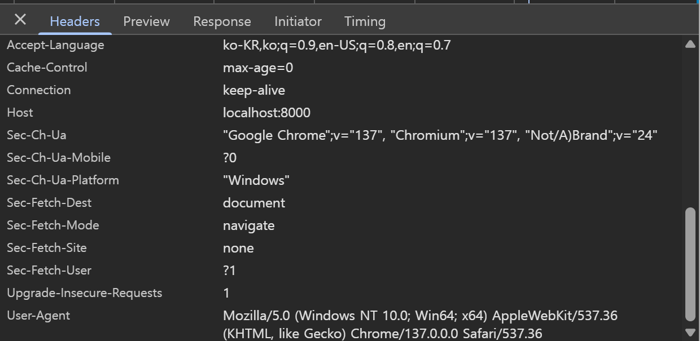

##  위에는 echo랑 거의 비슷함.

doit() 실제 서버에서 어떠한 응답을 위해 실행되는 함수

   - Rio_readinitb(&rio, fd) fd를 참조해서 rio 구조체를 초기화 ::rio_t 대해서 - fd에 버퍼, 접근횟수를 관리하는 구조체

   -  Rio_readlineb()fd 버퍼에 정보가 들어올 때까지 대기 - 정보가 들어오면 rio->buf 정보를 buf에 저장.

   - Request header 정보 터미널 출력
   printf 버퍼 값 출력
   - sscanf()로 buf의 저장된 line을 쪼개서 method, uri, version 변수에 저장
      - method = "GET", uri = "/" version = "HTTP/1.1"
   
   - strcasecmp()메서드로 문자열 두개가 같은지 검사. -같으면 0 같지 않으면 1 을 리턴하는느낌임.
   
         GET호출이 아니면, clienterror 함수 호출되어서
         <html><title>Tiny Error</title><body bgcolor=ffffff>
         501: Not implemented **short-msg 
         
Tiny does not implement this method: GET   **long-msg
         
<em>The Tiny Web server</em>
   ---
         그게 아니라면 read_requesthdrs()함수가 호출되어 버퍼에 저장된 첫 line 출력 후,
         버퍼에 "\r\n" 문자가 들어올 때까지, 반복하여 fd로 클라이언트에게 전달 받은 요청header 읽어옴.

   

   - 이후 parse_uri() 리턴 값을 is_static 변수에 저장
     - parse_uri()
       - 인자로 char*들, uri , filename, cgiargs를 받음
       - strcpy(cgiargs, ""); ""을 cgiargs 변수에 대입.
       - strcat() 로 기존 문자열에 덧붙이기
       - static-content를 사용하면 return 1; (uri 시작이 "cgi-bin"이 아니면)
       - else니까 cgi-bin 이면, return 0;
       - 

   

